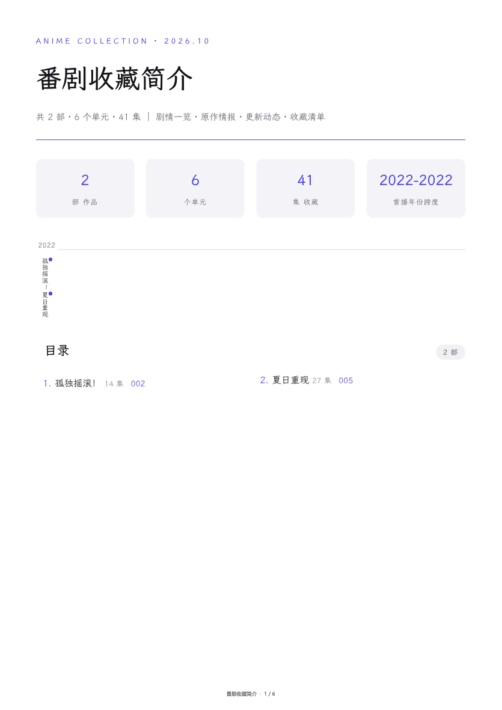

# anime-collection-book

把一份**番剧名字清单**（或本机视频收藏库）做成一本"杂志风"PDF 收藏册：

总览统计卡 → 可点击目录（带页码）→ 数说收藏页（大数字统计）→ 每部作品一个主题色章节（**主题色自动取自该部封面**）：
官方海报 · 台词卡 · 无剧透简介 · 制作与声优 · 原作情报 · 补番顺序 · 逐季剧透详情表 · 更新动态。
**海报墙封面 + 「完」字封底**（书名可配），全书中文字体内嵌（霞鹜文楷子集），PDF 带可折叠书签与页脚页码。
**系列完整度审计**（每部「收录 M/N 条」+ 待补清单）· `npm run cards` 一键导出**竖版收藏卡 PNG** 与高清整页图（社交发图）。

> **内置两个领域包**：`config.json` 的 `"domain"` 切换 —— `anime`（默认，本仓库主示例）／`novel`：把同一引擎用于**小说设定集**——每个角色一章、伏笔追踪表（franchise 字段承载）、数说设定页、读者向脱敏版，全程离线。字段映射见 [domain-novel.md](anime-collection-book/skills/anime-collection-book/references/domain-novel.md)。

这是一个给 **AI agent**（Claude Code / ZCode / Cursor 等，需具备文件读写 + Shell + 联网 + 读图能力）使用的 skill，符合 [Agent Skills 开放格式](https://code.claude.com/docs/en/skills)（SKILL.md + 附属脚本），同时按 Claude Code **插件市场**规范打包。

| 总览页（统计卡 + 年份时间轴 + 带页码目录） | 章节首页（官方海报 + 结构化制作表 + 状态徽章） |
|---|---|
|  |  |

## 安装

**Claude Code（推荐，一条命令）：**

```
/plugin marketplace add 123ccw/anime-collection-book
/plugin install anime-collection-book@anime-collection-book
```

装好后说"我想给这几部番做个收藏册：…"即可触发。

**其他 agent（手动）：**

把 `anime-collection-book/skills/anime-collection-book/` 整个文件夹拷进对应工具的技能目录，让 agent 读其中的 `SKILL.md` 照做：

| 工具 | 技能目录 |
|---|---|
| Claude Code | `~/.claude/skills/` 或项目内 `.claude/skills/` |
| ZCode | `~/.agents/skills/` 或项目内 `.agents/skills/` |
| 其他支持 Agent Skills 格式的工具 | 查阅其文档的技能目录约定（格式通用，无需改文件） |

## 两种用法

| | 模式 A · 报菜名 | 模式 B · 本机收藏（进阶·可选） |
|---|---|---|
| 输入 | `names.txt`（一行一部番剧名） | 本机结构化视频库 |
| 内容来源 | agent 在线调研（AniList/Bangumi/Wiki） | 本机元数据 + agent 补充调研 |
| 额外依赖 | 无 | ffmpeg（抽帧补封面）+ **自备扫描脚本** |

> 模式 B 面向"已按『每部一个文件夹、每集带封面与元数据』整理过收藏"的玩家。**扫描视频库生成 base.json 的脚本未随包提供**（各人目录结构不同）——可让 agent 参照 SKILL.md 里的 `anime_base.json` 结构说明写一个。

## 快速开始

1. 项目根目录（任意空文件夹）：`fonts/` 放入 [霞鹜文楷](https://github.com/lxgw/LxgwWenKai/releases) 的 Regular/Medium TTF
2. 写 `names.txt`（一行一部番剧名），让 agent 按 `SKILL.md` 完成调研（产出 `anime_research/` 与 `anime_base.json`）
3. 在 skill 的 `scripts/` 目录里：
   ```bash
   npm i                                    # 装依赖（首次）
   # 把 config.json 的 root 改成你的项目根，然后：
   npm run pipeline                         # 一键：字体子集 → 两轮构建渲染 → 页码核对
   npm run check                            # 自动断言（产物完整性 / 页码全命中 / 无乱码）
   npm run sheet                            # 生成全页联络表（目检用）
   ```

## 脚本（skills/anime-collection-book/scripts/）

| 文件 | 作用 |
|---|---|
| `collect_fonts.js` | 中文字体子集化（防缺字；需 Python fonttools+brotli） |
| `names_to_base.js` | 名单+调研 JSON → 构建输入（`npm run base`） |
| `build_anime_html.js` | 排版 HTML（主题色/海报/结构化制作表/状态徽章/时间轴） |
| `render_pw.js` | Playwright 渲染 PDF（书签+页脚） |
| `anime_pagemap.js` | 书签反查每部起始页（两轮渲染的核心） |
| `contact_sheet.js` | 全页联络表（目检用，`npm run sheet`） |

**配置**：所有脚本统一读 `config.json`（`root` = 项目根，`vroot` = 模式 B 视频库根）；日常一条 `npm run pipeline` 跑完。

## 质检铁律

封面必须让 agent 亲眼看（防张冠李戴）；查不到的信息写"未核实"，禁止编造；发布前全页目检。
完整踩坑清单（13 条）与数据源用法见 [`references/pipeline.md`](anime-collection-book/skills/anime-collection-book/references/pipeline.md)。

## 许可

代码 MIT。霞鹜文楷字体版权归其作者，遵循 [SIL OFL 1.1](https://openfontlicense.org/)（需自行下载）。
