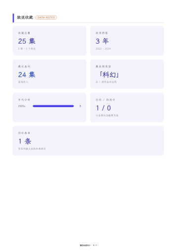
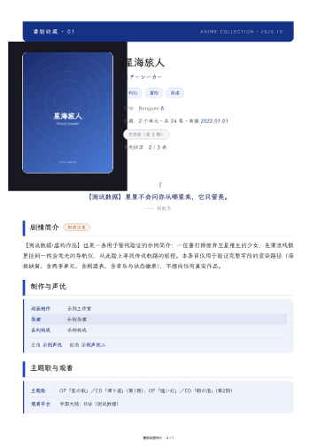

# fanbook

> 原名 `anime-collection-book`，2026-10 更名为 **fanbook** —— 同一套引擎已同时覆盖「番剧收藏册」与「小说设定集」两个领域包，旧名以偏概全。旧仓库链接由 GitHub 自动重定向。

把一份**番剧名字清单**（或本机视频收藏库）做成一本"杂志风"PDF 收藏册：

总览统计卡 → 可点击目录（带页码）→ 数说收藏页（大数字统计）→ 每部作品一个主题色章节（**主题色自动取自该部封面**）：
官方海报 · 台词卡 · 无剧透简介 · 制作与声优 · 原作情报 · 补番顺序 · 逐季剧透详情表 · 更新动态。
**海报墙封面 + 「完」字封底**（书名可配），全书中文字体内嵌（霞鹜文楷子集），PDF 带可折叠书签与页脚页码。
**系列完整度审计**（每部「收录 M/N 条」+ 待补清单）· `npm run cards` 一键导出**竖版收藏卡 PNG** 与高清整页图（社交发图）。

> **内置两个领域包**：`config.json` 的 `"domain"` 切换 —— `anime`（默认，本仓库主示例）／`novel`：把同一引擎用于**小说设定集**——每个角色一章、伏笔追踪表（franchise 字段承载）、数说设定页、读者向脱敏版，全程离线。字段映射见 [domain-novel.md](fanbook/skills/fanbook/references/domain-novel.md)。

这是一个给 **AI agent**（Claude Code / ZCode / Cursor 等，需具备文件读写 + Shell + 联网 + 读图能力）使用的 skill，符合 [Agent Skills 开放格式](https://code.claude.com/docs/en/skills)（SKILL.md + 附属脚本），同时按 Claude Code **插件市场**规范打包。

> 以下效果图为 **虚构演示作品**（`evals/fixture/`，含程序生成的示例封面）——真实书本使用官方海报时请遵守下方「关于素材版权」。

## 为什么做它（四个踩过的坑）

这不是"排版工具"的炫技，是四个具体失败模式的解法。每条都有对应的机制，不是靠自觉：

| # | 会翻车的地方 | 机制 |
| --- | --- | --- |
| 1 | **目录页码手工排一定会错**——加一章、换张封面就全错位 | 两轮「构建 → 渲染 → 书签反查页码」，第二次把真实页码印回目录；`check` 再断言**两轮页码完全一致**（不是只比目录，那会自证） |
| 2 | **中文字体直接嵌 PDF 会缺字／出现方块**，300 页书还能把体积撑到几十 MB | 按实际用到的字符做**字体子集**再 base64 内嵌；封底自动附 OFL 版权署名 |
| 3 | **海报极易张冠李戴**（同名角色、同名作品、把舞台远景当封面） | 取图**官方渠道优先**、逐张**多模态目检**、每次取图记一条**来源台账** |
| 4 | **版权与隐私翻车都在看不见的地方**：分发的册子零署名、外发时把本机路径和片单一起带出去 | 封底**默认**输出「非官方粉丝作品 · 仅供个人收藏」+ 资料来源；`compliance.md` 给外发清理清单；`pack` 时再提醒一次 |

> 一句话：**它把"看起来小事、实际每次都会错"的环节都做成了断言或默认行为。**

<table>
  <tr>
    <td width="50%" align="center"><b>总览页</b><br>统计卡 · 年份时间轴 · 带页码目录<br><br></td>
    <td width="50%" align="center"><b>数说收藏页</b><br>大数字统计 · 年代分布<br><br></td>
  </tr>
  <tr>
    <td colspan="2" align="center"><b>章节首页</b>——海报 · 台词卡 · 结构化制作表 · 状态徽章<br><br></td>
  </tr>
</table>

## 安装

**Claude Code（推荐，一条命令）：**

```
/plugin marketplace add 123ccw/fanbook
/plugin install fanbook@fanbook
```

装好后说"我想给这几部番做个收藏册：…"即可触发。

**其他 agent（手动）：**

把 `fanbook/skills/fanbook/` 整个文件夹拷进对应工具的技能目录，让 agent 读其中的 `SKILL.md` 照做：

| 工具 | 技能目录 |
|---|---|
| Claude Code | `~/.claude/skills/` 或项目内 `.claude/skills/` |
| ZCode / Codex 等 agents 规范 | `~/.agents/skills/` 或项目内 `.agents/skills/` |
| **DeepSeek Harness（DSH）** | `~/.dsh/skills/`（DSH 自己的）**或** `~/.agents/skills/`（agents 规范目录，**DSH 也会读**） |
| 其他支持 Agent Skills 格式的工具 | 查阅其文档的技能目录约定（格式通用，无需改文件） |

> ⚠️ **DSH 同时扫 `~/.dsh/skills` 与 `~/.agents/skills`**（实测）：同一个 skill 两处都放，会话里就会出现两份、还会互相抢触发。**选一处放就行**；同理，别把同一个技能市场同时用"插件安装"和"手动拷目录"两种方式各装一遍。

## 两种用法

| | 模式 A · 报菜名 | 模式 B · 本机收藏（进阶·可选） |
|---|---|---|
| 输入 | `names.txt`（一行一部番剧名） | 本机结构化视频库 |
| 内容来源 | agent 在线调研（AniList/Bangumi/Wiki） | 本机元数据 + agent 补充调研 |
| 额外依赖 | 无 | ffmpeg（抽帧补封面）+ **自备扫描脚本** |

> 模式 B 面向"已按『每部一个文件夹、每集带封面与元数据』整理过收藏"的玩家。**扫描视频库生成 base.json 的脚本未随包提供**（各人目录结构不同）——可让 agent 参照 SKILL.md 里的 `anime_base.json` 结构说明写一个。

## 适用范围与边界

**适合**：一部/一批作品的收藏册（**5-20 部体验最好**）；本机视频库的成册归档；小说设定集与伏笔追踪（novel 域，全程离线）。

**故意不做**（不是遗漏，是取舍）：

| 不做 | 为什么 |
| --- | --- |
| 追番进度管理 / 更新提醒 | 那是 tracker 的活；PDF 是静态成品，不是状态容器 |
| 视频文件整理、重命名、媒体库刮削（Jellyfin/Emby/Plex） | 交给专门的刮削工具；本 skill 只读你**已经整理好**的库 |
| 已有 PDF 的格式转换 / 合并拆分 | 用 `flyingmouse-format` 之类的工具 |
| 小说正文的写作与排版 | 它做的是**设定资料集**，不是正文 |
| 替用户判断图片授权、自动抓取版权图 | 取图渠道由你决定，工具只负责**记录来源**（`npm run sources`） |
| 在线托管与分享 | 产出是一个文件，怎么发由你决定 |

> 规模提示：调研是主要成本（每部都要联网查证 + 核图）。**5-20 部体验最好**；上百部请分批做，别一次铺开。

## 快速开始

1. 项目根目录（任意空文件夹）：`fonts/` 放入 [霞鹜文楷](https://github.com/lxgw/LxgwWenKai/releases) 的 Regular/Medium TTF（缺省字体；也可在 `config.json` 的 `fonts` 里换成自备 TTF，先确认它允许嵌入与再分发）
2. 写 `names.txt`（一行一部番剧名），让 agent 按 `SKILL.md` 完成调研（产出 `anime_research/` 与 `anime_base.json`）
3. 在 skill 的 `scripts/` 目录里：
   ```bash
   npm i                                    # 装依赖（首次）
   # 把 config.json 的 root 改成你的项目根，然后：
   npm run doctor                           # 环境自检（node/python/字体/浏览器/curl/tvly/重复安装）
   npm run pipeline                         # 一键：字体子集 → 两轮构建渲染 → 页码核对
   npm run check                            # 产物断言（17 条：完整性 / 页码 / 两轮收敛 / PDF 层）→ 写 _check.json
   npm run probe                            # 只跑 PDF 层深检（正文缺字 + 书签）→ 写 _pdfprobe.json
   npm run audit                            # 数据完备度 → 写 _audit.json 与 receipts/<作品名>.json
   npm run sheet                            # 生成全页联络表（目检用）
   npm run pack -- --pages-reviewed --covers-reviewed   # 交付（签署你确实做过的目检）
   ```
   > 不想改 `config.json` 时，可用 `ANIME_BOOK_ROOT` 等环境变量覆盖（所有脚本统一读 `scripts/_config.js`）。

## 核验状态：交付说明会写清"哪几步真做了"

`npm run pack` 生成的交付说明带一节**核验状态**，把两类东西分开放——这是本 skill 唯一防"假绿"的机制：

| 环节 | 凭据 |
| --- | --- |
| 产物断言 `[C1]-[C17]` | `anime_build/_check.json`（脚本产出，可复现） |
| 数据完备度 `[A1]-[A10]` | `anime_build/_audit.json`（脚本产出，可复现） |
| **全页目检** | `pack --pages-reviewed` 的**声明**（`npm run sheet` 的 PNG 是材料，不是证据） |
| **封面逐张目检** | `pack --covers-reviewed` 的**声明** |

没签就写「未声明」，收据比成品旧就标「⚠ 过期」。**机器验不了的事不假装验过**——想让它变绿只有一条路：真的去做。

## 脚本（skills/fanbook/scripts/）

| 文件 | 作用 |
|---|---|
| `collect_fonts.js` | 中文字体子集化（防缺字；需 Python fonttools+brotli） |
| `names_to_base.js` | 名单+调研 JSON → 构建输入（`npm run base`） |
| `build_anime_html.js` | 排版 HTML（主题色/海报/结构化制作表/状态徽章/时间轴） |
| `render_pw.js` | Playwright 渲染 PDF（书签+页脚） |
| `anime_pagemap.js` | 书签反查每部起始页（两轮渲染的核心）；同时检测**书签重名**（书名撞作品名会让页码取错页）并原子写盘 |
| `contact_sheet.js` | 全页联络表（目检用，`npm run sheet`）；也支持**任意 PDF**：`node contact_sheet.js --pdf <路径> --out <目录>` |
| `doctor.js` | 环境自检（`npm run doctor`；node/python/字体/浏览器/curl/tvly/配置/**重复安装**一次查完） |
| `_titles.js` | 收录作品标题解析的单一事实源（pagemap 与 PDF 探针共用，避免两处漂移） |
| `sources.js` | 素材来源台账（`npm run sources` 默认**导出**台账；`add` 记录、`list` 打印；公开分享时核对授权用） |
| `pack.js` | 一键交付（`npm run pack`；把 PDF/HTML/分享卡/整页图/封面图/来源台账 + 自动生成的交付说明归拢到 `_deliver/`，说明里含核验状态表；`--strict` 可在有未核验项时非零退出） |
| `_config.js` | 配置单一事实源（`config.json` + `ANIME_BOOK_*` 环境变量；所有脚本共用） |
| `sync_version.js` | 版本号校验/同步（`npm run version:check` / `version:fix`；按 glob 发现清单，不写死路径） |

**验收脚本**（`evals/`）：`check.js`（产物断言 `[C1]-[C17]`，纯 fs 零依赖）、`pdfprobe.js`（PDF 层深检：正文缺字 / 书签丢失 / 书签重名）、`audit.js`（数据完备度）、`lint_skill.js`（skill 信封与文档数字一致性）。

**配置**：所有脚本统一读 `scripts/_config.js`（`root` = 项目根，`vroot` = 模式 B 视频库根，`fonts` = 自测用字体）；日常一条 `npm run pipeline` 跑完。

## 文档分级（入口很轻，细节按需读）

`SKILL.md` 只放**执行流程 + 质检铁律 + 最硬的坑位**（刻意保持精简，细节一律外置），拆到 `references/`，agent 按需读、不必全量吃进上下文：

| 文档 | 什么时候读 |
| --- | --- |
| `references/fields.md` | 写某部作品的调研 JSON 时（字段表 + 逐字段说明） |
| `references/research-contract.md` | **派调研子代理时**（并发上限、写哪些文件、失败重试、每部收据） |
| `references/build.md` | 跑构建/渲染/验收/交付时（config 字段 + 全部命令 + 交付规矩） |
| `references/pipeline.md` | 联网取数、遇到具体报错、要看 14 条完整坑位时 |
| `references/image-selection.md` | 选封面/立绘、判断该用哪张图、法律红线 |
| `references/compliance.md` | 交付前过版权与隐私（含来源台账用法、外发清理清单） |
| `references/domain-novel.md` | 做小说设定集（novel 域）时 |

## 质检铁律

封面必须让 agent 亲眼看（防张冠李戴）；每个字段要么带来源、要么写「未核实」；发布前全页目检。
完整踩坑清单（14 条）与数据源用法见 [`references/pipeline.md`](fanbook/skills/fanbook/references/pipeline.md)。

## 关于素材版权

本工具只做排版：**海报、立绘等图片由使用者自行从公开渠道获取**，本仓库不附带任何第三方作品素材（README 与 `evals/` 中的示例均为虚构作品或程序生成的占位图）。

生成的册子若包含官方海报/截图，请仅用于**个人收藏**；公开传播（发群、上传平台、印制售卖）前请自行评估授权——官方美术的版权属于各制作委员会/原作者。同理，角色设定与剧情资料的引用请标注来源（本工具支持在封底填写 `credits`）。

成品封底默认自带两行声明（**资料来源** + **非官方粉丝作品 · 仅供个人收藏**），不填 `credits` 也会输出，**请勿删除**。另外三条底线：

- **文字自己写**：剧情简介一类文字不要逐句搬运维基百科/萌娘百科的原文（事实可引用，**表述受 CC BY-SA 约束**），写完抽一句回搜验证
- **只用全年龄素材**：擦边/露骨素材一律不用——这类风险是刑事级，不是版权级
- **不用真人素材**：声优照片、真人演员肖像涉及肖像权
- **取图官方渠道优先**：动画官网 / 官方 X / 发行方 / 原作出版社 → AniList、Bangumi 条目图 → 图库（safebooru 等）**仅作候选对比兜底**。官方渠道的图授权链更干净、画质也是母版；用图库定位到图后，尽量回溯官方原图再入库

### 隐私：外发前请清理

把项目文件夹交给别人、上传网盘或打包分发前，删掉三个东西：

| 删什么 | 为什么 |
| --- | --- |
| `fanbook/skills/fanbook/scripts/config.json` | 含你的**本机绝对路径**（用户名） |
| `names.txt` | 你的片单 ＝ 观看偏好 |
| `anime_research/` | 调研稿与从网上抓下来的图片 |

这三样都不在版本库里（见 `.gitignore`），**但手动"拷贝整个文件夹"时会一起被带走**。顺手补一句好消息：生成的成品是干净的——实测 `<书名>.html` 与 `.pdf` 正文及元数据里都不含本机路径或用户名。交付说明里的**核验状态**也会如实标出没做的环节（见上文）。

## 许可

- **本仓库代码**：MIT（见 [LICENSE](LICENSE)；skill 信封内另有一份 `LICENSE.txt`，**只拷技能目录也不会丢许可**）
- **随包依赖与字体的义务**：见 [THIRD_PARTY_NOTICES.md](THIRD_PARTY_NOTICES.md) 与 skill 信封内的同名文件（playwright/pdfjs/canvas/fonttools/brotli 的许可，及"字体可替换"的注意事项）
- **使用时自备的字体**：缺省为霞鹜文楷（LXGW WenKai），SIL OFL 1.1 授权，版权归 **LXGW** 与上游 **The Klee Project Authors** 所有（基于 FONTWORKS「Klee One」衍生）。字体不进本仓库，需从 [GitHub Releases](https://github.com/lxgw/LxgwWenKai/releases) 自行下载；管线会子集化后嵌入你的成品，封底自动附版权署名（OFL 要求版权声明随字体软件分发，请勿删除）。换成别的字体时，请确认其许可允许嵌入与再分发，并同步改 `credits` 的署名。
